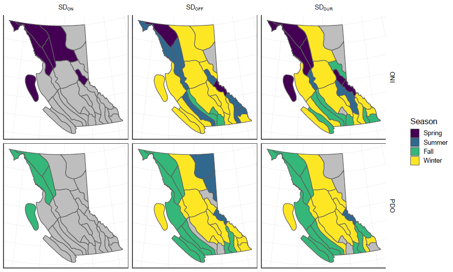

Timing and Duration of Snow Cover in British Columbia
==================================================

### Overview

Analysis of a 500 m gridded raster of the onset, melt and duration of snow cover in British Columbia using the MODIS Snow Cover Product (Collection 6) between 2002-2018. 

### Project Status

This project is under active development.

### Goals/Roadmap

Explain interannual variability by exploring ocean-climate teleconnections, time, and terrain as predictors of the onset, melt and duration of snow by hydrologic zones.

### Getting Help or Reporting an Issue

To report bugs/issues/feature requests, please file an [issue](https://github.com/bcgov/ts-rs-modis-snow/issues/).

### How to Contribute

If you would like to contribute, please see our [CONTRIBUTING](CONTRIBUTING.md) guidelines.

Please note that this project is released with a [Contributor Code of Conduct](CODE_OF_CONDUCT.md). By participating in this project you agree to abide by its terms.

### License

    Copyright 2018 Province of British Columbia

    Licensed under the Apache License, Version 2.0 (the "License");
    you may not use this file except in compliance with the License.
    You may obtain a copy of the License at

    http://www.apache.org/licenses/LICENSE-2.0

    Unless required by applicable law or agreed to in writing, software distributed under the License is distributed on an "AS IS" BASIS,
    WITHOUT WARRANTIES OR CONDITIONS OF ANY KIND, either express or implied.
    See the License for the specific language governing permissions and limitations under the License.

------------------------------------------------------------------------

*This project was created using the [bcgovr](https://github.com/bcgov/bcgovr) package.*
